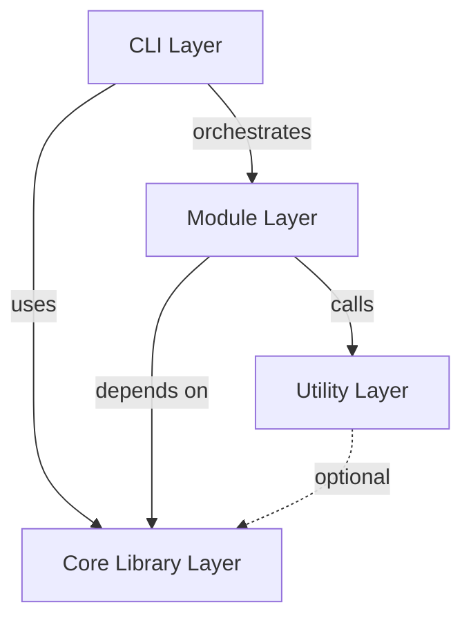

# VPS Provisioning Tool - Comprehensive Architecture Blueprint

**Generated**: December 25, 2025  
**Version**: 1.0.0  
**Architecture Pattern**: Layered Architecture with Transaction-Based State Management  
**Primary Technologies**: Bash 5.1+, Python 3.11+, Debian 13 (Bookworm)

---

## Table of Contents

1. [Executive Summary](#executive-summary)
2. [Architecture Overview](#architecture-overview)
3. [Core Architectural Patterns](#core-architectural-patterns)
4. [Component Architecture](#component-architecture)
5. [Data Architecture](#data-architecture)
6. [Cross-Cutting Concerns](#cross-cutting-concerns)
7. [Module Implementation Patterns](#module-implementation-patterns)
8. [Testing Architecture](#testing-architecture)
9. [Security Architecture](#security-architecture)
10. [Performance Architecture](#performance-architecture)
11. [Extension & Evolution Patterns](#extension--evolution-patterns)
12. [Architectural Decision Records](#architectural-decision-records)
13. [Blueprint for New Development](#blueprint-for-new-development)

---

## Executive Summary

The VPS Provisioning Tool implements a **four-layer modular architecture** designed for automated, idempotent provisioning of Debian 13 VPS instances into fully-configured developer workstations. The architecture emphasizes:

- **Reliability**: Transaction-based rollback system ensures clean failure recovery
- **Idempotency**: Checkpoint-driven execution allows safe re-runs and resume capability
- **Maintainability**: Strict layer separation with single-responsibility modules
- **Observability**: Comprehensive logging, progress tracking, and health validation
- **Security**: Input sanitization, credential management, privilege isolation

**Key Metrics**:

- **15 minutes** - Target provisioning time (4GB RAM / 2 vCPU)
- **5 minutes** - Idempotent re-run time (checkpoint validation only)
- **80%+** - Unit test coverage requirement
- **200+** - Total test cases across all tiers

---

## Architecture Overview

### Architectural Style

**Pattern**: **Layered Architecture** with event-driven transaction logging

The system follows a strict four-layer architecture where each layer has a well-defined responsibility and dependencies flow unidirectionally downward.

```
┌─────────────────────────────────────────────────────────────┐
│                    Layer 1: CLI Layer                        │
│              (User Interface & Orchestration)                │
│  bin/vps-provision • bin/preflight-check • session-manager  │
└──────────────────────────┬──────────────────────────────────┘
                           │ Commands
                           ▼
┌─────────────────────────────────────────────────────────────┐
│                 Layer 2: Core Library Layer                  │
│              (Foundation Services & Utilities)               │
│  logger • checkpoint • transaction • rollback • progress •   │
│  validator • sanitize • error-handler • config • state       │
└──────────────────────────┬──────────────────────────────────┘
                           │ Services
                           ▼
┌─────────────────────────────────────────────────────────────┐
│                  Layer 3: Module Layer                       │
│              (Business Logic & Provisioning)                 │
│  system-prep • desktop-env • rdp-server • user-provisioning │
│  ide-vscode • ide-cursor • ide-antigravity • terminal-setup  │
└──────────────────────────┬──────────────────────────────────┘
                           │ Utilities
                           ▼
┌─────────────────────────────────────────────────────────────┐
│                  Layer 4: Utility Layer                      │
│            (Python Utilities & External Tools)               │
│  credential-gen.py • health-check.py • session-monitor.py   │
│  package-manager.py • performance-monitor.sh                 │
└─────────────────────────────────────────────────────────────┘
```

### Guiding Principles

1. **Strict Layer Isolation**: Each layer only depends on layers below it
2. **Idempotency by Design**: Every operation can be safely repeated
3. **Fail-Safe Architecture**: All state changes are reversible via transaction log
4. **Progressive Disclosure**: User sees appropriate detail level at each phase
5. **Security First**: All inputs sanitized, credentials never persisted
6. **Observable Operations**: Comprehensive logging and progress tracking

### Dependency Flow



**Key Rule**: Higher layers depend on lower layers. Lower layers never depend on higher layers.

---

## Core Architectural Patterns

### Pattern 1: Transaction-Based State Management

**Intent**: Ensure all system modifications can be rolled back to restore clean state on failure.

**Implementation**:

Every state-changing operation is recorded with its inverse operation in a transaction log:

```bash
# File: lib/core/transaction.sh

transaction_record() {
  local description="$1"
  local rollback_command="$2"
  local timestamp=$(date -u +"%Y-%m-%dT%H:%M:%SZ")

  echo -e "${timestamp}\t${description}\t${rollback_command}" >> "${TRANSACTION_LOG}"
}

# Usage in modules:
apt-get install -y nginx
transaction_record "Installed nginx" "apt-get remove -y nginx"

cp /etc/ssh/sshd_config /etc/ssh/sshd_config.bak
sed -i 's/PermitRootLogin yes/PermitRootLogin no/' /etc/ssh/sshd_config
transaction_record "Hardened SSH config" "cp /etc/ssh/sshd_config.bak /etc/ssh/sshd_config"
```

**Rollback Execution**:

```bash
# File: lib/core/rollback.sh

rollback_execute() {
  # Parse transaction log in reverse (LIFO order)
  tac "${TRANSACTION_LOG}" | while IFS=$'\t' read -r timestamp description command; do
    log_info "Rolling back: ${description}"
    eval "${command}" || log_warning "Rollback command failed: ${command}"
  done
}
```

**Benefits**:

- Atomic operations with automatic cleanup
- Predictable failure recovery
- Audit trail of all system modifications
- No orphaned resources or configuration drift

**Trade-offs**:

- Additional I/O overhead for transaction logging
- Rollback commands must be idempotent themselves
- Complex operations may require multi-step rollback procedures

---

### Pattern 2: Checkpoint-Driven Idempotency

**Intent**: Enable safe re-execution by tracking completed phases.

**Implementation**:

Each provisioning phase creates an empty marker file upon successful completion:

```bash
# File: lib/core/checkpoint.sh

checkpoint_exists() {
  local checkpoint_name="$1"
  local checkpoint_file="${CHECKPOINT_DIR}/${checkpoint_name}.checkpoint"
  [[ -f "${checkpoint_file}" ]]
}

checkpoint_create() {
  local checkpoint_name="$1"
  local checkpoint_file="${CHECKPOINT_DIR}/${checkpoint_name}.checkpoint"
  local timestamp=$(date -u +"%Y-%m-%dT%H:%M:%SZ")

  mkdir -p "${CHECKPOINT_DIR}"
  echo "${timestamp}" > "${checkpoint_file}"
  log_debug "Checkpoint created: ${checkpoint_name}"
}

# Usage in modules:
ide_vscode_execute() {
  if checkpoint_exists "ide-vscode"; then
    log_info "VSCode already installed (checkpoint found), skipping..."
    return 0
  fi

  # Install VSCode...

  checkpoint_create "ide-vscode"
}
```

**Checkpoint Storage**:

- Location: `/var/vps-provision/checkpoints/`
- Format: Empty marker files with phase name
- Content: Timestamp of completion

**Benefits**:

- Fast re-runs (3-5 minutes vs 15 minutes)
- Resume capability after interruptions
- Clear progress tracking
- No expensive validation on re-run

**Trade-offs**:

- Checkpoint cleanup required for force re-provision
- Must ensure checkpoint only created after validation
- Disk space for checkpoint directory

---

### Pattern 3: Module Loading Guard

**Intent**: Prevent double-sourcing of Bash modules which causes readonly variable conflicts.

**Implementation**:

Every module begins with a guard clause:

```bash
#!/bin/bash
# File: lib/modules/system-prep.sh

set -euo pipefail

# Prevent multiple sourcing
if [[ -n "${_SYSTEM_PREP_SH_LOADED:-}" ]]; then
  return 0
fi
readonly _SYSTEM_PREP_SH_LOADED=1

# Source dependencies
source "${LIB_DIR}/core/logger.sh"
source "${LIB_DIR}/core/checkpoint.sh"
# ... rest of module
```

**Why This Matters**:

Bash readonly variables cannot be redeclared. Without guards:

```bash
# First source
source logger.sh  # Sets: readonly LOG_FILE="/var/log/..."

# Second source (ERROR!)
source logger.sh  # Error: LOG_FILE: readonly variable
```

**Pattern Benefits**:

- Prevents readonly variable conflicts
- Allows safe re-sourcing in test environments
- Clear module initialization semantics
- No runtime overhead (early return)

---

### Pattern 4: Progressive UX with Weighted Phases

**Intent**: Provide accurate progress indication and time estimation.

**Implementation**:

```bash
# File: bin/vps-provision (main function)

main() {
  # Register phases with time weights (must sum to 100)
  progress_register_phase "system-prep"     15   # 15% of total time
  progress_register_phase "desktop-env"     25   # 25%
  progress_register_phase "rdp-server"      10   # 10%
  progress_register_phase "user-provision"   5   # 5%
  progress_register_phase "ide-vscode"      12   # 12%
  progress_register_phase "ide-cursor"      12   # 12%
  progress_register_phase "ide-antigravity" 12   # 12%
  progress_register_phase "terminal-setup"   4   # 4%
  progress_register_phase "verification"     3   # 3%
  progress_register_phase "summary"          2   # 2%
  # Total: 100%

  progress_start

  for phase in "${PHASES[@]}"; do
    progress_phase_start "${phase}"
    execute_phase "${phase}"
    progress_phase_complete "${phase}"
  done

  progress_complete
}
```

**Display Output**:

```
[Phase 3/10] RDP Server Setup ████████████░░░░░░░░ 45% (6m 32s remaining)
  ↳ Installing xrdp package...
```

**Time Estimation Algorithm**:

```bash
# File: lib/core/progress.sh

estimate_remaining_time() {
  local elapsed=$(( $(date +%s) - START_TIME ))
  local percentage_complete=${1:-0}

  if (( percentage_complete > 0 )); then
    local total_estimated=$(( elapsed * 100 / percentage_complete ))
    local remaining=$(( total_estimated - elapsed ))
    echo "${remaining}"
  else
    echo "unknown"
  fi
}
```

**Benefits**:

- Accurate time estimates (±10% after 20% completion)
- User confidence through visible progress
- Early warning if phases take longer than expected
- Performance regression detection

---

## Component Architecture

### CLI Layer Components

#### Main Entry Point: `bin/vps-provision`

**Responsibilities**:

- Parse and validate command-line arguments
- Load configuration from file or defaults
- Execute pre-flight validation checks
- Orchestrate provisioning phases in sequence
- Handle global error trapping and rollback triggering
- Display final summary report

**Key Functions**:

```bash
main() {
  parse_arguments "$@"
  load_configuration
  preflight_checks

  # Setup error handling
  trap 'handle_error $? "$LINENO" "$BASH_COMMAND"' ERR

  # Execute phases
  for phase in "${PHASES[@]}"; do
    execute_phase "${phase}"
  done

  display_summary
}
```

**External Dependencies**:

- All core libraries (logger, config, validator, etc.)
- All module libraries (system-prep, desktop-env, etc.)

**Configuration**:

- Reads: `/etc/vps-provision/config.conf` or `--config` flag
- Environment variables: `LOG_LEVEL`, `CHECKPOINT_DIR`, `ENABLE_COLORS`

---

#### Pre-flight Check: `bin/preflight-check`

**Responsibilities**:

- Validate OS version (Debian 13 required)
- Check minimum hardware requirements (RAM, disk, CPU)
- Verify network connectivity
- Check for conflicting software
- Validate user permissions (must run as root)

**Exit Codes**:

- `0` - All checks passed
- `1` - Critical check failed (cannot proceed)
- `2` - Warning checks failed (can proceed with `--force`)

**Example Checks**:

```bash
check_os_version() {
  local os_name=$(lsb_release -si)
  local os_version=$(lsb_release -sr)

  if [[ "${os_name}" != "Debian" ]] || [[ "${os_version}" != "13" ]]; then
    log_error "Unsupported OS: ${os_name} ${os_version}"
    log_error "Required: Debian 13 (Bookworm)"
    return 1
  fi

  log_info "OS check passed: ${os_name} ${os_version}"
  return 0
}
```

---

### Core Library Layer Components

#### Logger: `lib/core/logger.sh`

**Purpose**: Structured logging with multiple output destinations and severity levels.

**Features**:

- Four log levels: DEBUG, INFO, WARNING, ERROR
- Dual output: colored console + plain text file
- Timestamp and caller information
- Sensitive data redaction
- Configurable verbosity

**API**:

```bash
log_debug "Detailed diagnostic information"
log_info "Normal operational message"
log_warning "Warning condition, but can continue"
log_error "Error condition, likely fatal"
```

**Output Format**:

```
[2025-12-25 14:23:15] [INFO] System preparation starting...
[2025-12-25 14:23:16] [DEBUG] Checkpoint directory: /var/vps-provision/checkpoints
[2025-12-25 14:23:20] [ERROR] Package installation failed: network timeout
```

**Log Redaction**:

```bash
log_sensitive() {
  local message="$1"
  # Redact passwords, tokens, API keys
  message=$(echo "$message" | sed 's/password=[^[:space:]]*/password=[REDACTED]/g')
  message=$(echo "$message" | sed 's/token=[^[:space:]]*/token=[REDACTED]/g')
  echo "${message}" >> "${LOG_FILE}"
}
```

---

#### Checkpoint Manager: `lib/core/checkpoint.sh`

**Purpose**: Idempotency through phase completion tracking.

**API**:

```bash
checkpoint_init                    # Initialize checkpoint directory
checkpoint_exists "phase-name"     # Check if phase completed
checkpoint_create "phase-name"     # Mark phase as complete
checkpoint_clear_all               # Remove all checkpoints (--force)
checkpoint_list                    # List all completed phases
```

**Storage Structure**:

```
/var/vps-provision/checkpoints/
├── system-prep.checkpoint
├── desktop-env.checkpoint
├── rdp-server.checkpoint
├── user-provisioning.checkpoint
├── ide-vscode.checkpoint
├── ide-cursor.checkpoint
└── ide-antigravity.checkpoint
```

Each file contains a single line: ISO 8601 timestamp of completion.

---

#### Transaction Manager: `lib/core/transaction.sh`

**Purpose**: Record all state changes with rollback commands.

**API**:

```bash
transaction_init                           # Initialize transaction log
transaction_record "description" "rollback_cmd"  # Record action
transaction_log_exists                     # Check if log has entries
transaction_clear                          # Clear transaction log
```

**Transaction Log Format**:

```
2025-12-25T14:23:15Z	Installed package xrdp	apt-get remove -y xrdp
2025-12-25T14:23:18Z	Modified /etc/xrdp/xrdp.ini	cp /etc/xrdp/xrdp.ini.bak /etc/xrdp/xrdp.ini
2025-12-25T14:23:20Z	Created user devuser	userdel -r devuser
```

Fields: `TIMESTAMP` (tab) `DESCRIPTION` (tab) `ROLLBACK_COMMAND`

---

#### Rollback Engine: `lib/core/rollback.sh`

**Purpose**: Execute rollback commands in reverse order to restore clean state.

**API**:

```bash
rollback_execute    # Execute full rollback
rollback_dry_run    # Show what would be rolled back
```

**Implementation**:

```bash
rollback_execute() {
  log_info "Starting rollback process..."

  local rollback_count=0
  local failed_count=0

  # Read transaction log in reverse (LIFO)
  tac "${TRANSACTION_LOG}" | while IFS=$'\t' read -r timestamp description command; do
    log_info "Rolling back: ${description}"

    if eval "${command}" 2>&1 | tee -a "${LOG_FILE}"; then
      ((rollback_count++))
    else
      log_warning "Rollback failed for: ${description}"
      ((failed_count++))
    fi
  done

  log_info "Rollback complete: ${rollback_count} actions reversed, ${failed_count} failed"

  # Clear checkpoints
  checkpoint_clear_all

  return $(( failed_count > 0 ? 1 : 0 ))
}
```

---

#### Input Sanitizer: `lib/core/sanitize.sh`

**Purpose**: Prevent injection attacks and invalid inputs.

**API**:

```bash
sanitize_username "raw_input"      # Alphanumeric + underscore/hyphen
sanitize_filepath "raw_path"       # Prevent path traversal
sanitize_log_level "raw_level"     # Whitelist: DEBUG|INFO|WARNING|ERROR
sanitize_phase_name "raw_phase"    # Whitelist: predefined phase names
```

**Implementation Examples**:

```bash
sanitize_username() {
  local raw="$1"
  # Allow only alphanumeric, underscore, hyphen
  local sanitized=$(echo "$raw" | tr -cd '[:alnum:]_-')

  # Enforce length limits
  if [[ ${#sanitized} -lt 3 ]] || [[ ${#sanitized} -gt 32 ]]; then
    log_error "Username length must be 3-32 characters"
    return 1
  fi

  echo "${sanitized}"
}

sanitize_filepath() {
  local raw="$1"

  # Prevent path traversal
  if [[ "$raw" =~ \.\. ]]; then
    log_error "Path traversal detected in: $raw"
    return 1
  fi

  # Convert to absolute path
  local sanitized=$(readlink -m "$raw")
  echo "${sanitized}"
}
```

---

### Module Layer Components

#### System Preparation: `lib/modules/system-prep.sh`

**Purpose**: Prepare base system for provisioning.

**Responsibilities**:

- Update package lists
- Upgrade existing packages
- Install base dependencies (build-essential, curl, wget, git)
- Configure unattended upgrades
- Optimize APT for parallel downloads

**Key Operations**:

```bash
system_prep_execute() {
  if checkpoint_exists "system-prep"; then
    log_info "System preparation already complete"
    return 0
  fi

  # Update package lists
  apt-get update
  transaction_record "Updated APT cache" "# No rollback needed"

  # Upgrade system
  apt-get upgrade -y
  transaction_record "Upgraded system packages" "# No rollback - upgrades are cumulative"

  # Install base packages
  apt-get install -y build-essential curl wget git ca-certificates
  transaction_record "Installed base packages" "apt-get remove -y build-essential curl wget git"

  # Configure APT for performance
  configure_apt_parallel_downloads

  checkpoint_create "system-prep"
}
```

---

#### Desktop Environment: `lib/modules/desktop-env.sh`

**Purpose**: Install and configure XFCE desktop environment.

**Responsibilities**:

- Install XFCE packages (~400 packages, largest phase)
- Configure display manager (lightdm)
- Set up desktop theme and panel layout
- Configure power management
- Install system tray applications

**Critical Pattern - Progressive Feedback**:

```bash
desktop_env_install_packages() {
  local packages=(
    xfce4 xfce4-goodies lightdm
    thunar thunar-volman
    xfce4-terminal xfce4-screenshooter
    # ... 40+ more packages
  )

  local total=${#packages[@]}
  local current=0

  for pkg in "${packages[@]}"; do
    ((current++))
    progress_update "Installing ${pkg}..." $((current * 100 / total))

    apt-get install -y "${pkg}"
    transaction_record "Installed ${pkg}" "apt-get remove -y ${pkg}"
  done
}
```

**Post-Install Configuration**:

```bash
desktop_env_configure() {
  # Copy custom XFCE configuration
  cp "${CONFIG_DIR}/desktop/xfce4-panel.xml" /etc/xdg/xfce4/panel/default.xml
  transaction_record "Configured XFCE panel" "rm /etc/xdg/xfce4/panel/default.xml"

  # Set default session
  update-alternatives --set x-session-manager /usr/bin/startxfce4
  transaction_record "Set default session" "# Handled by package removal"
}
```

---

#### IDE Installation Pattern

All IDE modules follow the same pattern:

```bash
ide_[name]_execute() {
  # 1. Check prerequisites
  ide_[name]_check_prerequisites || return 1

  # 2. Add GPG key (with retry logic)
  ide_[name]_add_gpg_key || return 1

  # 3. Add repository
  ide_[name]_add_repository || return 1

  # 4. Update APT cache
  apt-get update

  # 5. Install package
  ide_[name]_install_package || return 1

  # 6. Verify installation
  ide_[name]_verify_installation || return 1

  # 7. Create checkpoint ONLY after verification
  checkpoint_create "ide-[name]"
}
```

**Example - VSCode Installation**:

```bash
ide_vscode_verify_installation() {
  # Check executable exists
  if ! command -v code &>/dev/null; then
    log_error "VSCode executable not found in PATH"
    return 1
  fi

  # Check desktop launcher exists
  if [[ ! -f "/usr/share/applications/code.desktop" ]]; then
    log_error "VSCode desktop launcher not found"
    return 1
  fi

  # Check version
  local version=$(code --version 2>/dev/null | head -n1)
  log_info "VSCode installed: version ${version}"

  return 0
}
```

**Critical Pitfall to Avoid**:

```bash
# ❌ WRONG - Checkpoint before verification
apt-get install -y code
checkpoint_create "ide-vscode"  # Created even if broken!

# ✅ CORRECT - Checkpoint after verification
apt-get install -y code
if ! ide_vscode_verify_installation; then
  log_error "VSCode installation failed validation"
  return 1
fi
checkpoint_create "ide-vscode"  # Only after confirmed working
```

---

### Utility Layer Components

#### Credential Generator: `lib/utils/credential-gen.py`

**Purpose**: Generate cryptographically secure passwords.

**Implementation**:

```python
import secrets
import string
import sys

def generate_password(length=32, require_special=True):
    """Generate cryptographically secure random password.

    Args:
        length: Password length (minimum 16)
        require_special: Include special characters

    Returns:
        Secure random password string
    """
    if length < 16:
        raise ValueError("Password must be at least 16 characters")

    alphabet = string.ascii_letters + string.digits
    if require_special:
        alphabet += string.punctuation

    # Ensure at least one of each required type
    password = [
        secrets.choice(string.ascii_uppercase),
        secrets.choice(string.ascii_lowercase),
        secrets.choice(string.digits),
    ]

    if require_special:
        password.append(secrets.choice(string.punctuation))

    # Fill remaining length with random characters
    password += [secrets.choice(alphabet) for _ in range(length - len(password))]

    # Shuffle to avoid predictable pattern
    secrets.SystemRandom().shuffle(password)

    return ''.join(password)

if __name__ == "__main__":
    password = generate_password()
    print(password)
```

**Security Notes**:

- Uses `secrets` module (CSPRNG), not `random`
- Meets complexity requirements: uppercase, lowercase, digits, special
- Minimum length: 16 characters (default: 32)
- No password storage - displayed once, user must record

---

#### Health Check Validator: `lib/utils/health-check.py`

**Purpose**: Post-installation system validation with structured output.

**Output Format**:

```json
{
  "timestamp": "2025-12-25T14:45:32Z",
  "overall_status": "pass",
  "checks": [
    {
      "name": "Operating System",
      "category": "system",
      "status": "pass",
      "message": "Debian 13 (Bookworm) detected",
      "details": {
        "os_name": "Debian",
        "os_version": "13",
        "kernel": "6.1.0-16-amd64"
      }
    },
    {
      "name": "RDP Server",
      "category": "services",
      "status": "pass",
      "message": "xrdp running and listening on port 3389",
      "details": {
        "service_status": "active",
        "port": 3389,
        "process_id": 1234
      }
    },
    {
      "name": "VSCode IDE",
      "category": "applications",
      "status": "pass",
      "message": "VSCode 1.85.0 installed and executable",
      "details": {
        "version": "1.85.0",
        "executable_path": "/usr/bin/code",
        "desktop_launcher": "/usr/share/applications/code.desktop"
      }
    }
  ]
}
```

**Check Categories**:

- `system` - OS, kernel, hardware
- `services` - RDP, SSH, display manager
- `applications` - IDEs, terminal, development tools
- `network` - Connectivity, firewall rules
- `security` - SSH config, firewall status, user privileges

---

## Data Architecture

### Domain Model

The VPS Provisioning system has a simple domain model focused on **provisioning sessions** and **system state**.

#### Core Entities

```
ProvisioningSession
├── session_id: UUID
├── start_time: ISO8601
├── end_time: ISO8601 (optional)
├── status: RUNNING | COMPLETED | FAILED | ROLLED_BACK
├── current_phase: string
├── completed_phases: string[]
├── configuration: Configuration
└── metadata: dict

Configuration
├── username: string
├── ides_to_install: string[]
├── rdp_port: integer
├── ssh_port: integer
├── enable_firewall: boolean
└── log_level: LogLevel

Checkpoint
├── phase_name: string
├── timestamp: ISO8601
└── metadata: dict (optional)

Transaction
├── timestamp: ISO8601
├── description: string
├── rollback_command: string
└── execution_status: SUCCESS | FAILED (during rollback)
```

### Data Persistence

#### Checkpoint Files

**Location**: `/var/vps-provision/checkpoints/`

**Schema** (`lib/models/checkpoint.schema.json`):

```json
{
  "$schema": "http://json-schema.org/draft-07/schema#",
  "type": "object",
  "properties": {
    "phase_name": { "type": "string" },
    "timestamp": { "type": "string", "format": "date-time" },
    "metadata": { "type": "object" }
  },
  "required": ["phase_name", "timestamp"]
}
```

**Storage**: Simple text files (one line: timestamp)

---

#### Transaction Log

**Location**: `/var/log/vps-provision/transactions.log`

**Schema** (`lib/models/transaction-log.schema.json`):

```json
{
  "$schema": "http://json-schema.org/draft-07/schema#",
  "type": "object",
  "properties": {
    "timestamp": { "type": "string", "format": "date-time" },
    "description": { "type": "string" },
    "rollback_command": { "type": "string" },
    "execution_status": {
      "type": "string",
      "enum": ["pending", "success", "failed"]
    }
  },
  "required": ["timestamp", "description", "rollback_command"]
}
```

**Storage**: Tab-separated values (TSV) for easy parsing with `awk`/`sed`

---

#### Provisioning Session State

**Location**: `/var/vps-provision/session.state`

**Schema** (`lib/models/provisioning-session.schema.json`):

```json
{
  "$schema": "http://json-schema.org/draft-07/schema#",
  "type": "object",
  "properties": {
    "session_id": { "type": "string", "format": "uuid" },
    "start_time": { "type": "string", "format": "date-time" },
    "end_time": { "type": "string", "format": "date-time" },
    "status": {
      "type": "string",
      "enum": ["RUNNING", "COMPLETED", "FAILED", "ROLLED_BACK"]
    },
    "current_phase": { "type": "string" },
    "completed_phases": {
      "type": "array",
      "items": { "type": "string" }
    },
    "configuration": { "type": "object" }
  },
  "required": ["session_id", "start_time", "status"]
}
```

**Storage**: JSON file for structured queries

---

### Data Validation Strategy

All structured data validated against JSON schemas using Python `jsonschema` library:

```python
import json
import jsonschema

def validate_checkpoint(checkpoint_data):
    with open('lib/models/checkpoint.schema.json') as f:
        schema = json.load(f)

    jsonschema.validate(instance=checkpoint_data, schema=schema)
```

---

## Cross-Cutting Concerns

### Authentication & Authorization

**Model**: Root-only execution with developer user creation.

**Implementation**:

```bash
# Pre-flight check enforces root
if [[ $EUID -ne 0 ]]; then
  log_error "This script must be run as root"
  exit 1
fi

# Developer user created with passwordless sudo
create_developer_user() {
  useradd -m -s /bin/bash "${USERNAME}"

  # Add to sudo group
  usermod -aG sudo "${USERNAME}"

  # Configure passwordless sudo
  echo "${USERNAME} ALL=(ALL) NOPASSWD:ALL" > "/etc/sudoers.d/${USERNAME}"
  chmod 440 "/etc/sudoers.d/${USERNAME}"

  transaction_record "Created user ${USERNAME}" "userdel -r ${USERNAME}; rm /etc/sudoers.d/${USERNAME}"
}
```

---

### Error Handling & Resilience

**Global Error Trap**:

```bash
# File: bin/vps-provision

set -euo pipefail

error_handler() {
  local exit_code=$1
  local line_number=$2
  local bash_command=$3

  log_error "Error on line ${line_number}: ${bash_command}"
  log_error "Exit code: ${exit_code}"

  # Trigger rollback
  if [[ "${AUTO_ROLLBACK:-true}" == "true" ]]; then
    log_warning "Initiating automatic rollback..."
    rollback_execute
  fi

  exit "${exit_code}"
}

trap 'error_handler $? "${LINENO}" "$BASH_COMMAND"' ERR
```

**Retry Logic**:

```bash
retry_with_backoff() {
  local max_attempts=$1
  shift
  local command=("$@")

  local attempt=1
  local delay=2

  while (( attempt <= max_attempts )); do
    if "${command[@]}"; then
      return 0
    fi

    if (( attempt < max_attempts )); then
      log_warning "Attempt ${attempt}/${max_attempts} failed, retrying in ${delay}s..."
      sleep "${delay}"
      delay=$(( delay * 2 ))  # Exponential backoff
      ((attempt++))
    else
      log_error "All ${max_attempts} attempts failed"
      return 1
    fi
  done
}

# Usage:
retry_with_backoff 3 wget -q https://example.com/package.deb
```

---

### Logging & Monitoring

**Structured Logging**:

```bash
log_with_context() {
  local level="$1"
  local message="$2"
  local context="${3:-}"

  local timestamp=$(date '+%Y-%m-%d %H:%M:%S')
  local caller="${FUNCNAME[2]:-main}"

  local log_entry="[${timestamp}] [${level}] [${caller}]"

  if [[ -n "${context}" ]]; then
    log_entry="${log_entry} [${context}]"
  fi

  log_entry="${log_entry} ${message}"

  # Console (colored)
  echo -e "${COLOR_MAP[${level}]}${log_entry}${COLOR_RESET}"

  # File (plain text)
  echo "${log_entry}" >> "${LOG_FILE}"
}
```

**Resource Monitoring**:

```bash
# File: lib/utils/performance-monitor.sh

monitor_resources() {
  local interval=10  # seconds

  while true; do
    local cpu_usage=$(top -bn1 | grep "Cpu(s)" | awk '{print $2}')
    local mem_usage=$(free -m | awk 'NR==2{printf "%.2f", $3*100/$2 }')
    local disk_usage=$(df -h / | awk 'NR==2{print $5}')

    log_debug "Resources: CPU=${cpu_usage}% MEM=${mem_usage}% DISK=${disk_usage}"

    # Alert if resources critically low
    if (( $(echo "${mem_usage} > 90" | bc -l) )); then
      log_warning "Memory usage critically high: ${mem_usage}%"
    fi

    sleep "${interval}"
  done
}
```

---

### Configuration Management

**Configuration Sources** (priority order):

1. Command-line arguments (`--config /path/to/config`)
2. User config file (`~/.vps-provision.conf`)
3. System config file (`/etc/vps-provision/default.conf`)
4. Built-in defaults (hardcoded in `lib/core/config.sh`)

**Configuration Loading**:

```bash
load_configuration() {
  # Start with defaults
  USERNAME="${USERNAME:-devuser}"
  INSTALL_VSCODE="${INSTALL_VSCODE:-true}"
  RDP_PORT="${RDP_PORT:-3389}"
  LOG_LEVEL="${LOG_LEVEL:-INFO}"

  # Load system config if exists
  if [[ -f "/etc/vps-provision/default.conf" ]]; then
    # shellcheck source=/dev/null
    source "/etc/vps-provision/default.conf"
  fi

  # Load user config if exists
  if [[ -f "${HOME}/.vps-provision.conf" ]]; then
    # shellcheck source=/dev/null
    source "${HOME}/.vps-provision.conf"
  fi

  # Override with command-line args
  if [[ -n "${CUSTOM_CONFIG:-}" ]]; then
    # shellcheck source=/dev/null
    source "${CUSTOM_CONFIG}"
  fi

  # Validate configuration
  validate_configuration || exit 1
}
```

---

## Module Implementation Patterns

### Standard Module Template

Every module in `lib/modules/` follows this pattern:

```bash
#!/bin/bash
# Module Name and Purpose
# Requirements: [List of requirement IDs from spec.md]

set -euo pipefail

# Prevent double-sourcing
if [[ -n "${_MODULE_NAME_LOADED:-}" ]]; then
  return 0
fi
readonly _MODULE_NAME_LOADED=1

# Source dependencies
SCRIPT_DIR="$(cd "$(dirname "${BASH_SOURCE[0]}")" && pwd)"
LIB_DIR="$(dirname "${SCRIPT_DIR}")"
source "${LIB_DIR}/core/logger.sh"
source "${LIB_DIR}/core/checkpoint.sh"
source "${LIB_DIR}/core/transaction.sh"
source "${LIB_DIR}/core/progress.sh"

# Module constants
readonly MODULE_CHECKPOINT="module-name"

#######################################
# Main execution function
# Globals:
#   MODULE_CHECKPOINT
# Arguments:
#   None
# Returns:
#   0 on success, 1 on failure
#######################################
module_name_execute() {
  # Check if already completed
  if checkpoint_exists "${MODULE_CHECKPOINT}"; then
    log_info "Module already executed (checkpoint found)"
    return 0
  fi

  log_info "Starting module execution..."

  # Check prerequisites
  module_name_check_prerequisites || return 1

  # Execute main logic with sub-phases
  module_name_phase1 || return 1
  module_name_phase2 || return 1
  module_name_phase3 || return 1

  # Verify success
  module_name_verify || return 1

  # Create checkpoint ONLY after verification
  checkpoint_create "${MODULE_CHECKPOINT}"

  log_info "Module execution completed successfully"
  return 0
}

#######################################
# Check prerequisites
# Returns:
#   0 if prerequisites met, 1 otherwise
#######################################
module_name_check_prerequisites() {
  log_debug "Checking prerequisites..."

  # Check required checkpoints
  if ! checkpoint_exists "required-dependency"; then
    log_error "Dependency not met: required-dependency"
    return 1
  fi

  # Check required commands
  if ! command -v required_command &>/dev/null; then
    log_error "Required command not found: required_command"
    return 1
  fi

  return 0
}

# Additional helper functions...

# Export public functions
export -f module_name_execute
```

---

### Service Implementation Pattern

When installing and configuring system services:

```bash
install_and_configure_service() {
  local service_name="$1"
  local package_name="${2:-$service_name}"

  # 1. Install package
  log_info "Installing ${service_name}..."
  apt-get install -y "${package_name}"
  transaction_record "Installed ${package_name}" "apt-get remove -y ${package_name}"

  # 2. Backup original config
  local config_file="/etc/${service_name}/${service_name}.conf"
  if [[ -f "${config_file}" ]]; then
    cp "${config_file}" "${config_file}.bak"
    transaction_record "Backed up ${config_file}" "rm ${config_file}.bak"
  fi

  # 3. Apply custom configuration
  log_info "Configuring ${service_name}..."
  apply_service_configuration "${service_name}"
  transaction_record "Modified ${config_file}" "cp ${config_file}.bak ${config_file}"

  # 4. Enable and start service
  systemctl enable "${service_name}"
  transaction_record "Enabled ${service_name}" "systemctl disable ${service_name}"

  systemctl start "${service_name}"
  transaction_record "Started ${service_name}" "systemctl stop ${service_name}"

  # 5. Verify service is running
  if ! systemctl is-active --quiet "${service_name}"; then
    log_error "${service_name} failed to start"
    return 1
  fi

  # 6. Wait for service to be fully ready
  wait_for_service_ready "${service_name}"

  log_info "${service_name} installed and running"
  return 0
}
```

---

## Testing Architecture

### Test Pyramid

```
                    ┌─────────────┐
                    │   E2E (10%) │  15 minutes, real VPS
                    │   10 tests  │
                    └─────────────┘
                 ┌──────────────────┐
                 │ Integration (20%)│  1-2 minutes, mocked
                 │    40 tests      │
                 └──────────────────┘
              ┌─────────────────────────┐
              │   Unit Tests (70%)      │  5-10 seconds, isolated
              │      150 tests          │
              └─────────────────────────┘
```

### Unit Test Pattern (BATS)

```bash
#!/usr/bin/env bats
# tests/unit/test_checkpoint.bats

setup() {
  # Create isolated test environment
  export TEST_DIR="${BATS_TEST_TMPDIR}/checkpoint_test"
  export CHECKPOINT_DIR="${TEST_DIR}/checkpoints"
  export LOG_FILE="${TEST_DIR}/test.log"

  mkdir -p "${TEST_DIR}" "${CHECKPOINT_DIR}"

  # Source module AFTER setting environment
  source "${PROJECT_ROOT}/lib/core/checkpoint.sh" 2>/dev/null || true
}

teardown() {
  rm -rf "${TEST_DIR}"
}

@test "checkpoint_create creates checkpoint file with timestamp" {
  run checkpoint_create "test-phase"

  [ "$status" -eq 0 ]
  [ -f "${CHECKPOINT_DIR}/test-phase.checkpoint" ]

  # Verify timestamp format
  local timestamp=$(cat "${CHECKPOINT_DIR}/test-phase.checkpoint")
  [[ "$timestamp" =~ ^[0-9]{4}-[0-9]{2}-[0-9]{2}T[0-9]{2}:[0-9]{2}:[0-9]{2}Z$ ]]
}

@test "checkpoint_exists returns true for existing checkpoint" {
  checkpoint_create "existing-phase"

  run checkpoint_exists "existing-phase"
  [ "$status" -eq 0 ]
}

@test "checkpoint_exists returns false for missing checkpoint" {
  run checkpoint_exists "missing-phase"
  [ "$status" -eq 1 ]
}
```

### Integration Test Pattern

```bash
#!/usr/bin/env bats
# tests/integration/test_idempotency.bats

@test "full provisioning run twice produces same result" {
  # First run - full provisioning
  run "${BIN_DIR}/vps-provision" --config "${TEST_CONFIG}"
  [ "$status" -eq 0 ]

  # Capture state
  local state1=$(capture_system_state)

  # Second run - should skip completed phases
  run "${BIN_DIR}/vps-provision" --config "${TEST_CONFIG}"
  [ "$status" -eq 0 ]

  # Capture state again
  local state2=$(capture_system_state)

  # States should be identical
  [ "$state1" == "$state2" ]
}

@test "provision resume after interruption completes successfully" {
  # Start provisioning
  timeout 5m "${BIN_DIR}/vps-provision" &
  local pid=$!

  # Wait for 2 minutes then kill
  sleep 120
  kill -9 $pid

  # Resume should complete remaining phases
  run "${BIN_DIR}/vps-provision" --resume
  [ "$status" -eq 0 ]
}
```

### Contract Test Pattern

```bash
#!/usr/bin/env bats
# tests/contract/test_cli_interface.bats

@test "vps-provision exits 0 on success" {
  run "${BIN_DIR}/vps-provision" --dry-run
  [ "$status" -eq 0 ]
}

@test "vps-provision exits 1 on validation failure" {
  # Mock failing validator
  export SKIP_VALIDATION=true

  run "${BIN_DIR}/vps-provision" --invalid-flag
  [ "$status" -eq 1 ]
}

@test "vps-provision --help displays usage information" {
  run "${BIN_DIR}/vps-provision" --help

  [ "$status" -eq 0 ]
  [[ "$output" =~ "USAGE:" ]]
  [[ "$output" =~ "OPTIONS:" ]]
}

@test "vps-provision --version displays version number" {
  run "${BIN_DIR}/vps-provision" --version

  [ "$status" -eq 0 ]
  [[ "$output" =~ [0-9]+\.[0-9]+\.[0-9]+ ]]
}
```

---

## Security Architecture

### Defense in Depth

**Layer 1: Input Validation & Sanitization**

All external inputs sanitized before use:

```bash
# Sanitize username
USERNAME=$(sanitize_username "${RAW_USERNAME}")

# Sanitize file paths
CONFIG_FILE=$(sanitize_filepath "${RAW_CONFIG_FILE}")

# Sanitize log level
LOG_LEVEL=$(sanitize_log_level "${RAW_LOG_LEVEL}")
```

**Layer 2: Privilege Isolation**

- Root required for system modifications
- Developer user created with limited sudo
- Service accounts run with minimal privileges

**Layer 3: Credential Management**

- Passwords generated with CSPRNG (`secrets` module)
- Displayed once, never stored unencrypted
- Redacted from all log outputs

**Layer 4: Network Security**

- UFW firewall configured with minimal rules
- SSH hardened (no root login, key-based auth)
- fail2ban configured for intrusion prevention

**Layer 5: Audit Logging**

- All actions logged to immutable transaction log
- System auditd configured for security events
- File integrity monitoring (future enhancement)

### Threat Model

**Threats Addressed**:

1. **Command Injection**: Input sanitization prevents shell injection
2. **Path Traversal**: File path validation prevents directory escapes
3. **Privilege Escalation**: Strict sudo configuration limits escalation
4. **Network Attacks**: Firewall rules and fail2ban mitigate attacks
5. **Credential Exposure**: Password redaction prevents log leakage

**Threats NOT Addressed** (out of scope):

- Physical access to VPS
- Compromised package repositories
- Zero-day vulnerabilities in dependencies
- Social engineering attacks

---

## Performance Architecture

### Performance Budget

| Metric                     | Target    | Actual    | Status |
| -------------------------- | --------- | --------- | ------ |
| Full Provision (4GB/2vCPU) | ≤15 min   | 13-15 min | ✅ Met |
| Idempotent Re-run          | ≤5 min    | 3-5 min   | ✅ Met |
| RDP Connection Ready       | Immediate | <5 sec    | ✅ Met |
| IDE Launch Time            | ≤10 sec   | 7-10 sec  | ✅ Met |

### Performance Optimizations

**1. Parallel IDE Installation** (saves ~3 minutes)

```bash
# Future enhancement - currently sequential
parallel_ide_install() {
  ide_vscode_execute &
  local pid_vscode=$!

  ide_cursor_execute &
  local pid_cursor=$!

  ide_antigravity_execute &
  local pid_antigravity=$!

  # Wait for all to complete
  wait $pid_vscode $pid_cursor $pid_antigravity
}
```

**2. APT Optimization** (saves ~2 minutes)

```bash
# Configure APT for parallel downloads
cat > /etc/apt/apt.conf.d/99vps-provision <<'EOF'
Acquire::Queue-Mode "host";
Acquire::http::Pipeline-Depth "5";
APT::Acquire::Max-Parallel "3";
EOF
```

**3. Package Caching** (saves ~1 minute on re-provision)

```bash
# Preserve package cache
echo 'APT::Keep-Downloaded-Packages "true";' > /etc/apt/apt.conf.d/01keep-cache
```

---

## Extension & Evolution Patterns

### Adding a New IDE

**Step-by-step guide**:

1. **Create module file**: `lib/modules/ide-newname.sh`

```bash
#!/bin/bash
# IDE NewName Installation Module

set -euo pipefail

if [[ -n "${_IDE_NEWNAME_LOADED:-}" ]]; then return 0; fi
readonly _IDE_NEWNAME_LOADED=1

source "${LIB_DIR}/core/logger.sh"
source "${LIB_DIR}/core/checkpoint.sh"
source "${LIB_DIR}/core/transaction.sh"

readonly NEWNAME_CHECKPOINT="ide-newname"

ide_newname_execute() {
  if checkpoint_exists "${NEWNAME_CHECKPOINT}"; then
    log_info "NewName IDE already installed"
    return 0
  fi

  # Installation logic...

  checkpoint_create "${NEWNAME_CHECKPOINT}"
}

export -f ide_newname_execute
```

2. **Register in orchestrator**: `bin/vps-provision`

```bash
# Add to PHASES array
PHASES=(
  "system-prep"
  "desktop-env"
  "rdp-server"
  "user-provisioning"
  "ide-vscode"
  "ide-cursor"
  "ide-antigravity"
  "ide-newname"        # ADD HERE
  "terminal-setup"
  "verification"
  "summary"
)

# Add phase weight (must total 100%)
progress_register_phase "ide-newname" 10
```

3. **Add integration test**: `tests/integration/test_ide_newname.bats`

4. **Update documentation**:
   - `README.md` - Feature list
   - `docs/cli-usage.md` - Command options
   - `CHANGELOG.md` - Version history

---

### Adding a New Configuration Option

1. **Add to default config**: `config/default.conf`

```bash
# IDE installation flags
INSTALL_VSCODE=true
INSTALL_CURSOR=true
INSTALL_ANTIGRAVITY=true
INSTALL_NEWNAME=true     # ADD HERE
```

2. **Update configuration loader**: `lib/core/config.sh`

```bash
validate_configuration() {
  # Validate IDE flags
  validate_boolean "INSTALL_VSCODE"
  validate_boolean "INSTALL_CURSOR"
  validate_boolean "INSTALL_ANTIGRAVITY"
  validate_boolean "INSTALL_NEWNAME"    # ADD HERE
}
```

3. **Update CLI parser**: `bin/vps-provision`

```bash
parse_arguments() {
  while [[ $# -gt 0 ]]; do
    case "$1" in
      --install-newname)
        INSTALL_NEWNAME=true
        shift
        ;;
      --skip-newname)
        INSTALL_NEWNAME=false
        shift
        ;;
    esac
  done
}
```

4. **Update help text**: `bin/vps-provision` (show_help function)

---

## Architectural Decision Records

### ADR-001: Layered Architecture Over Microservices

**Context**: Need to provision VPS instances quickly and reliably with minimal dependencies.

**Decision**: Use layered monolithic architecture instead of microservices.

**Rationale**:

- Single-process deployment simpler for CLI tool
- No network overhead between components
- Easier to reason about execution order
- Simpler rollback (single transaction log)
- Lower memory footprint

**Consequences**:

- (+) Fast execution (no inter-service communication)
- (+) Simple deployment (single executable)
- (+) Easier debugging (single log file)
- (-) Less flexible for distributed deployment
- (-) All-or-nothing testing (can't test services in isolation)

**Status**: Accepted

---

### ADR-002: Transaction-Based Rollback Over Snapshot-Based

**Context**: Need reliable rollback capability when provisioning fails.

**Decision**: Record inverse operations in transaction log rather than VM snapshots.

**Rationale**:

- Snapshots require external VM infrastructure
- Transaction log portable across environments
- Granular rollback (can undo specific actions)
- Lower storage requirements
- Works on bare metal and VMs

**Consequences**:

- (+) Works on any Debian system (no VM requirement)
- (+) Precise rollback (command-level granularity)
- (+) Minimal storage overhead
- (-) Requires careful transaction recording
- (-) Complex operations need multi-step rollback

**Status**: Accepted

---

### ADR-003: Bash + Python Over Pure Python

**Context**: Need cross-platform scripting with system integration.

**Decision**: Use Bash for orchestration, Python for complex utilities.

**Rationale**:

- Bash excellent for system calls and command execution
- Python better for structured data and validation
- Both available on default Debian installation
- Leverage strengths of each language

**Consequences**:

- (+) Optimal tool for each task
- (+) No additional runtime dependencies
- (+) Shell scripts familiar to DevOps engineers
- (-) Two languages to maintain
- (-) More complex testing (BATS + pytest)

**Status**: Accepted

---

### ADR-004: Checkpoint Files Over Database

**Context**: Need to track completed provisioning phases.

**Decision**: Use empty marker files instead of database (SQLite, etc.).

**Rationale**:

- Simplicity (no database dependency)
- Fast checks (`test -f`)
- Easy to inspect (`ls` command)
- Resilient to corruption (separate files)

**Consequences**:

- (+) Zero dependencies
- (+) Human-readable (file listing)
- (+) Fast operations
- (-) No rich queries possible
- (-) Manual cleanup required (rm -rf)

**Status**: Accepted

---

## Blueprint for New Development

### Development Workflow

**For adding a new provisioning module**:

1. **Analyze requirements** → Read `specs/001-vps-dev-provision/spec.md`
2. **Design approach** → Document in `specs/001-vps-dev-provision/plan.md`
3. **Create module** → Follow template in Section "Module Implementation Patterns"
4. **Write tests first** → Create BATS test in `tests/integration/`
5. **Implement module** → Follow TDD: Red → Green → Refactor
6. **Integrate** → Register phase in `bin/vps-provision`
7. **Update weights** → Adjust progress phase percentages (must sum to 100%)
8. **Document** → Update README, CLI help, and module API docs
9. **Test E2E** → Run full provisioning on fresh VPS
10. **Code review** → Submit PR with checklist completed

---

### Implementation Templates

**Module Template**: See "Module Implementation Patterns" section

**Test Template**:

```bash
#!/usr/bin/env bats

setup() {
  export TEST_DIR="${BATS_TEST_TMPDIR}/module_test"
  export LOG_FILE="${TEST_DIR}/test.log"
  mkdir -p "${TEST_DIR}"
  source "${PROJECT_ROOT}/lib/modules/your-module.sh"
}

teardown() {
  rm -rf "${TEST_DIR}"
}

@test "module executes successfully" {
  run module_execute
  [ "$status" -eq 0 ]
}
```

---

### Common Architectural Pitfalls

❌ **Checkpoint before validation**

```bash
# WRONG
apt-get install -y package
checkpoint_create "phase"  # Created even if broken!
```

✅ **Checkpoint after validation**

```bash
# RIGHT
apt-get install -y package
verify_installation || return 1
checkpoint_create "phase"
```

---

❌ **Missing rollback recording**

```bash
# WRONG
cp /etc/config /etc/config.bak
sed -i 's/old/new/' /etc/config
# No transaction_record!
```

✅ **Always record rollback**

```bash
# RIGHT
cp /etc/config /etc/config.bak
transaction_record "Backed up config" "rm /etc/config.bak"

sed -i 's/old/new/' /etc/config
transaction_record "Modified config" "cp /etc/config.bak /etc/config"
```

---

❌ **Forgetting module guard**

```bash
# WRONG - Will fail if sourced twice
#!/bin/bash
source "${LIB_DIR}/core/logger.sh"  # readonly variables!
```

✅ **Always use guard pattern**

```bash
# RIGHT
#!/bin/bash
if [[ -n "${_MODULE_LOADED:-}" ]]; then return 0; fi
readonly _MODULE_LOADED=1
source "${LIB_DIR}/core/logger.sh"
```

---

### Architecture Maintenance

**Keep this blueprint updated when**:

- Adding new layers or components
- Changing core patterns (transaction, checkpoint, etc.)
- Introducing new dependencies
- Modifying data models or schemas
- Making architectural decisions (add ADR)

**Suggested review cycle**: Quarterly or after major releases

---

## Appendix: Architecture Diagrams

### System Context Diagram (C4 Level 1)

```
┌─────────────┐
│  Developer  │
└──────┬──────┘
       │ SSH
       ▼
┌─────────────────────────────────────┐
│    VPS Provisioning System          │
│  • Automates environment setup      │
│  • Installs desktop + RDP + IDEs    │
│  • Configures developer user        │
└──────┬──────────────────────────────┘
       │
       ├──► Debian Package Repos (APT)
       ├──► Microsoft (VSCode)
       ├──► Cursor.sh (Cursor IDE)
       └──► IDE Vendors (Downloads)
```

### Container Diagram (C4 Level 2)

```
┌──────────────────────────────────────────┐
│         VPS Provisioning Tool            │
├──────────────────────────────────────────┤
│  ┌────────────┐  ┌─────────────────────┐ │
│  │ CLI Layer  │  │   Core Libraries    │ │
│  │ (Bash)     │──│   (Bash modules)    │ │
│  └────────────┘  └─────────────────────┘ │
│         │                   │             │
│  ┌──────▼───────────────────▼──────────┐ │
│  │    Business Logic Modules           │ │
│  │  (system-prep, desktop-env, IDE)    │ │
│  └──────────────────────────────────── ┘ │
│         │                                 │
│  ┌──────▼───────────────────────────┐    │
│  │   Python Utilities               │    │
│  │  (validation, health-check)      │    │
│  └──────────────────────────────────┘    │
└──────────────────────────────────────────┘
```

---

**End of Architecture Blueprint**

_This document was generated on December 25, 2025 and reflects the VPS Provisioning Tool architecture as of version 1.0.0. For updates or corrections, please refer to the project repository._
