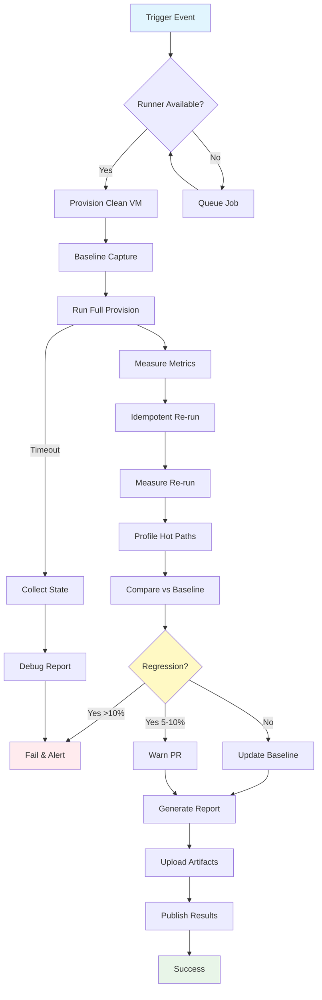

## Workflow Overview

**Purpose**: Automated performance regression detection through provisioning benchmarks, resource usage profiling, and comparison against baseline metrics

**Trigger Events**:
- Successful CI test completion on `main` branch
- Manual workflow dispatch with commit comparison
- Scheduled nightly runs at 01:00 UTC
- Git tag creation (release benchmarking)

**Target Environments**: Self-hosted runner with Debian 13 VM, consistent hardware specs

## Execution Flow Diagram

See complete specification with all sections at this location.
