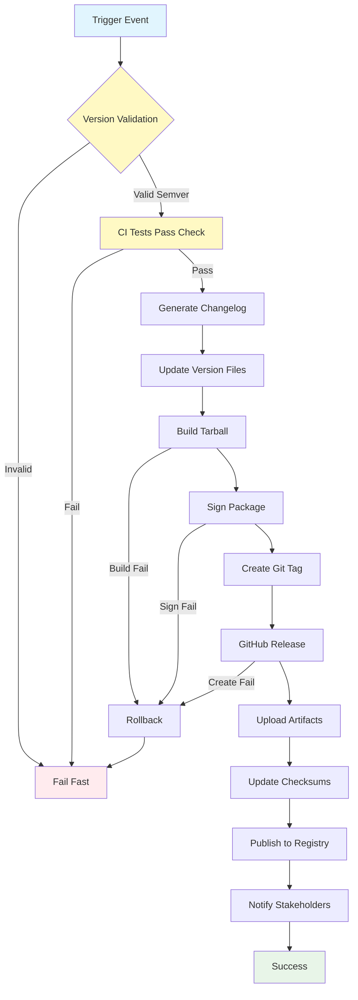

## Workflow Overview

**Purpose**: Automated package creation, version tagging, changelog generation, and distribution artifact publishing for VPS provisioning tool

**Trigger Events**:
- Manual workflow dispatch with version parameter
- Git tag push matching `v*.*.*` pattern
- Release branch merge to `main`

**Target Environments**: Ubuntu 22.04 runners, GitHub Releases

## Execution Flow Diagram



## Jobs & Dependencies

| Job Name | Purpose | Dependencies | Execution Context |
|----------|---------|--------------|-------------------|
| validate-version | Validate semantic version format, check uniqueness | None | ubuntu-latest |
| check-ci-status | Ensure CI tests passed for release commit | validate-version | ubuntu-latest |
| generate-changelog | Auto-generate CHANGELOG.md from commits since last release | check-ci-status | ubuntu-latest |
| update-metadata | Update version in files, scripts, documentation | generate-changelog | ubuntu-latest |
| build-package | Execute `bin/release.sh` to create distribution tarball | update-metadata | ubuntu-latest |
| sign-artifacts | GPG sign tarball and generate checksums | build-package | ubuntu-latest |
| create-tag | Create and push Git tag with version | sign-artifacts | ubuntu-latest |
| create-release | Create GitHub Release with notes and artifacts | create-tag | ubuntu-latest |
| publish-registry | Upload to package registry (optional future extension) | create-release | ubuntu-latest |
| notify | Send notifications to Slack/email | create-release | ubuntu-latest |

## Requirements Matrix

### Functional Requirements

| ID | Requirement | Priority | Acceptance Criteria |
|----|-------------|----------|-------------------|
| REQ-001 | Validate semantic versioning compliance | High | Reject non-semver versions |
| REQ-002 | Generate changelog from commit history | High | Changelog includes all commits since last tag |
| REQ-003 | Update version in all project files | High | 5+ files updated atomically |
| REQ-004 | Create signed distribution tarball | High | Tarball includes bin/, lib/, config/, docs/ |
| REQ-005 | Create GitHub Release with notes | High | Release visible in GitHub UI |
| REQ-006 | Upload artifacts with checksums | High | SHA256 checksums provided |
| REQ-007 | Tag git commit with release version | High | Tag pushed to origin |
| REQ-008 | Rollback on any failure | Medium | No partial releases published |
| REQ-009 | Notify on successful release | Low | Slack message sent |

### Security Requirements

| ID | Requirement | Implementation Constraint |
|----|-------------|---------------------------|
| SEC-001 | GPG sign all release artifacts | Use organization GPG key from secrets |
| SEC-002 | Validate CI pass before release | Require green CI status check |
| SEC-003 | Restrict release trigger to maintainers | Branch protection + CODEOWNERS enforcement |
| SEC-004 | Audit trail for all releases | Workflow logs retained 90 days |
| SEC-005 | Verify tarball contents before publish | Checksum validation step |

### Performance Requirements

| ID | Metric | Target | Measurement Method |
|----|-------|--------|-------------------|
| PERF-001 | Total workflow duration | <5 minutes | Workflow timer |
| PERF-002 | Package build time | <2 minutes | Job timer |
| PERF-003 | Changelog generation | <30 seconds | Job timer |
| PERF-004 | Artifact upload | <1 minute | Job timer |

## Input/Output Contracts

### Inputs

```yaml
# Manual Dispatch Inputs
workflow_dispatch:
  version: string           # Purpose: Semantic version (e.g., 1.2.3)
  prerelease: boolean       # Purpose: Mark as pre-release/beta
  draft: boolean            # Purpose: Create draft release for review
  skip_tests: boolean       # Purpose: Bypass CI check (emergency only)

# Tag Trigger Input
tag_pattern: v*.*.*         # Purpose: Auto-trigger on version tags

# Environment Variables
RELEASE_CHANNEL: string     # Purpose: stable/beta/alpha channel
GPG_KEY_ID: string          # Purpose: Signing key identifier
REGISTRY_URL: string        # Purpose: Optional package registry URL
```

### Outputs

```yaml
# Job Outputs
release_version: string     # Description: Final version published
release_url: string         # Description: GitHub Release URL
tarball_path: string        # Description: Path to distribution tarball
changelog_excerpt: string   # Description: Release notes for this version

# Artifacts
release-tarball: file       # Description: vps-provision-{version}.tar.gz
checksums: file             # Description: SHA256SUMS.txt
signature: file             # Description: tarball.tar.gz.asc (GPG signature)
changelog: file             # Description: CHANGELOG.md for this release
```

### Secrets & Variables

| Type | Name | Purpose | Scope |
|------|------|---------|-------|
| Secret | GPG_PRIVATE_KEY | Package signing | Repository |
| Secret | GPG_PASSPHRASE | GPG key passphrase | Repository |
| Secret | GITHUB_TOKEN | Release creation, tag push | Automatic |
| Secret | SLACK_WEBHOOK | Release notifications | Organization |
| Variable | RELEASE_CHANNEL | Distribution channel | Repository |
| Variable | MAINTAINER_EMAIL | Package metadata | Repository |

## Execution Constraints

### Runtime Constraints

- **Timeout**: 15 minutes total workflow timeout
- **Concurrency**: Only 1 release workflow at a time (group: release)
- **Resource Limits**:
  - Memory: 2GB per job
  - CPU: 2 cores
  - Disk: 5GB for build artifacts

### Environmental Constraints

- **Runner Requirements**:
  - Ubuntu 22.04 LTS
  - GPG 2.x for signing
  - Git 2.x for tagging
  - tar and gzip utilities
- **Network Access**:
  - External: github.com (API), registry URL (if configured)
  - Internal: None
- **Permissions**:
  - Read/Write: Repository contents
  - Write: Releases, tags
  - Admin: Repository (for protected branch bypass if needed)

## Error Handling Strategy

| Error Type | Response | Recovery Action |
|------------|----------|-----------------|
| Invalid Version Format | Fail immediately, notify | Correct version, retry |
| CI Tests Not Passed | Block release, notify | Wait for CI fix, retry |
| Changelog Generation Fail | Warn, use manual notes | Review commits manually |
| Build Failure | Fail, preserve logs | Debug locally, fix, retry |
| Signing Failure | Fail, alert security team | Verify GPG key, retry |
| Tag Already Exists | Fail, notify | Use next version number |
| Release Creation Fail | Retry 3x, then fail | Check GitHub API status |
| Upload Failure | Retry 3x, then fail | Check network, retry |
| Notification Failure | Log only, don't fail workflow | Manual notification |

## Quality Gates

### Gate Definitions

| Gate | Criteria | Bypass Conditions |
|------|----------|-------------------|
| Version Validation | Valid semver, not already released | Never bypass |
| CI Status | All CI checks passed on commit | Emergency hotfix with justification |
| Changelog Generation | At least 1 commit since last release | Manual override with notes |
| Build Success | Tarball created, all files included | Never bypass |
| Signature Verification | Valid GPG signature | Never bypass |
| Tag Uniqueness | Tag doesn't exist on remote | Never bypass |

## Monitoring & Observability

### Key Metrics

- **Release Frequency**: Track releases per month
- **Build Success Rate**: Target >95%
- **Time to Release**: From trigger to published <5 min
- **Artifact Size**: Monitor tarball size growth
- **Download Count**: Track release popularity (GitHub API)

### Alerting

| Condition | Severity | Notification Target |
|-----------|----------|-------------------|
| Release failure | Critical | Slack #releases, email maintainers |
| Signing failure | Critical | Security team, halt releases |
| Version conflict | High | Release manager |
| Build time >5min | Warning | DevOps team |
| Successful release | Info | Slack #releases, changelog channel |

## Integration Points

### External Systems

| System | Integration Type | Data Exchange | SLA Requirements |
|--------|------------------|---------------|------------------|
| GitHub Releases API | REST API | JSON release metadata | 99.9% uptime |
| GitHub Tags API | Git protocol | Git tag objects | 99.9% uptime |
| Slack | Webhook | JSON notification | Best effort |
| Package Registry | HTTP Upload | Tarball + metadata | 99.5% uptime |

### Dependent Workflows

| Workflow | Relationship | Trigger Mechanism |
|----------|--------------|-------------------|
| CI Testing | Prerequisite | Release requires CI green status |
| Security Scan | Prerequisite | Release requires no HIGH+ vulnerabilities |
| Documentation Deploy | Sequential | Triggered after successful release |
| Changelog Update | Embedded | Part of release workflow |

## Compliance & Governance

### Audit Requirements

- **Release Logs**: All workflow runs logged and retained 1 year
- **Approval Gates**: Maintainer approval required for production releases
- **Change Control**: Release notes must reference issues/PRs
- **Artifact Retention**: Release artifacts retained indefinitely

### Security Controls

- **Access Control**: Only organization members with "maintain" role can trigger
- **Secret Management**: GPG keys rotated annually
- **Signature Verification**: All releases must be GPG signed
- **Supply Chain Security**: SBOM generation for dependencies

## Edge Cases & Exceptions

### Scenario Matrix

| Scenario | Expected Behavior | Validation Method |
|----------|-------------------|-------------------|
| Same version released twice | Reject, fail workflow | Check existing tags/releases |
| Pre-release version (beta) | Mark as pre-release, no notifications | Use prerelease flag |
| Hotfix release | Skip normal branch checks, expedite | Use skip_tests input |
| Emergency unsigned release | Blocked, must sign | No bypass mechanism |
| Network failure during upload | Retry 3x with backoff, then fail | Built-in retry logic |
| Malformed changelog | Use fallback generic notes | Validation in changelog job |
| Git tag push fails | Rollback release, notify | Verify permissions |
| Concurrent release attempts | Queue second, cancel on conflict | Concurrency group |

## Validation Criteria

### Workflow Validation

- **VLD-001**: Version follows semver format exactly
- **VLD-002**: All updated files contain correct version
- **VLD-003**: Tarball extracts cleanly and contains expected structure
- **VLD-004**: GPG signature verifies successfully
- **VLD-005**: Git tag created and pushed to origin
- **VLD-006**: GitHub Release visible with correct assets
- **VLD-007**: Checksums match uploaded artifacts
- **VLD-008**: Notifications sent to configured channels

### Performance Benchmarks

- **PERF-001**: Version validation <5 seconds
- **PERF-002**: Changelog generation <30 seconds
- **PERF-003**: Package build <2 minutes
- **PERF-004**: Release creation <1 minute
- **PERF-005**: Total workflow <5 minutes (cold run)

## Change Management

### Update Process

1. **Specification Update**: Modify this document first
2. **Review & Approval**: Release manager + DevOps lead review
3. **Implementation**: Apply changes to `.github/workflows/release.yml`
4. **Testing**: Test on staging branch with prerelease flag
5. **Deployment**: Merge to main, test with real release candidate
6. **Validation**: Monitor first 2-3 releases closely

### Version History

| Version | Date | Changes | Author |
|---------|------|---------|--------|
| 1.0 | 2025-12-25 | Initial specification | DevOps Team |

## Related Specifications

- [CI Testing Workflow](spec-process-cicd-testing.md)
- [Security Scanning Workflow](spec-process-cicd-security.md)
- [Release Script Specification](../../bin/release.sh)
- [Versioning Policy](../../docs/versioning.md)

## Release Checklist Template

Pre-Release Validation:
- [ ] All CI tests passing on main branch
- [ ] No HIGH/CRITICAL security vulnerabilities
- [ ] CHANGELOG.md updated or will be auto-generated
- [ ] Version number decided and approved
- [ ] Release notes drafted
- [ ] Stakeholders notified of upcoming release

Post-Release Validation:
- [ ] GitHub Release created successfully
- [ ] Artifacts uploaded with checksums
- [ ] GPG signature valid
- [ ] Git tag pushed to origin
- [ ] Notifications sent
- [ ] Download link tested
- [ ] Documentation updated
