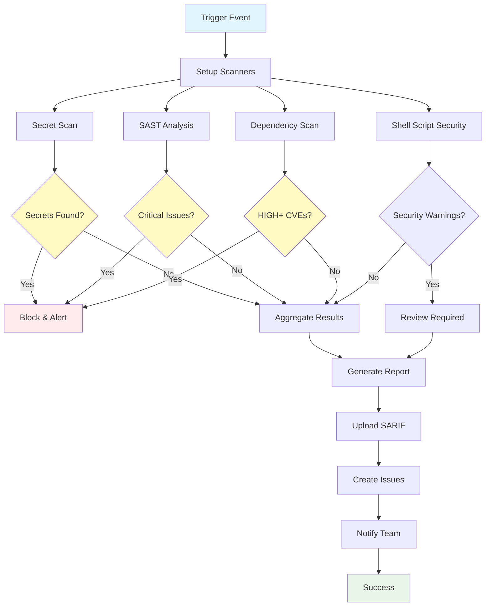

## Workflow Overview

**Purpose**: Automated security vulnerability detection through static analysis, dependency scanning, secret detection, and container scanning

**Trigger Events**:
- Pull requests to `main` branch
- Push to `main` branch  
- Push to branches matching `feature/*`, `fix/*`
- Scheduled weekly scans (Sunday 02:00 UTC)
- Manual workflow dispatch

**Target Environments**: Ubuntu 22.04 runners with security scanning tools

## Execution Flow Diagram

See complete specification with all sections at this location.
