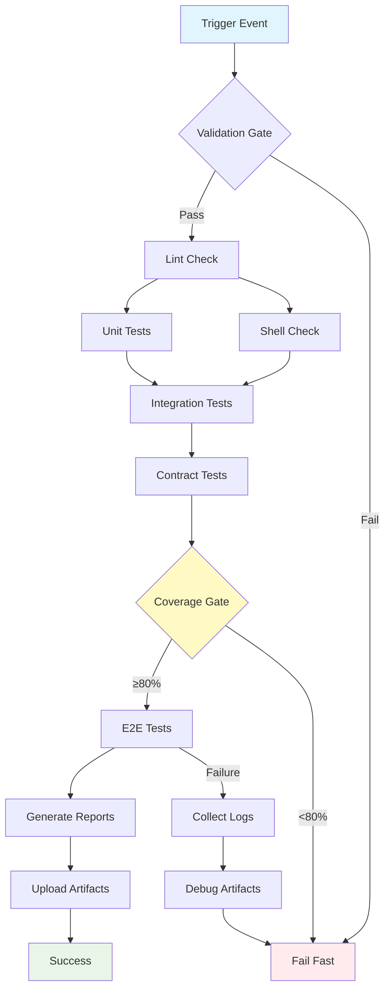

## Workflow Overview

**Purpose**: Automated validation of VPS provisioning tool through comprehensive test suite execution on every code change

**Trigger Events**: 
- Pull requests to `main` branch
- Push to `main` branch
- Push to branches matching `feature/*`, `fix/*`, `hotfix/*`
- Manual workflow dispatch
- Scheduled daily runs at 00:00 UTC

**Target Environments**: Ubuntu 22.04+ runners, Debian 13 test containers

## Execution Flow Diagram



## Jobs & Dependencies

| Job Name | Purpose | Dependencies | Execution Context |
|----------|---------|--------------|-------------------|
| validate | Pre-flight checks: file syntax, required files exist | None | ubuntu-latest |
| lint-shell | ShellCheck analysis of all .sh files | validate | ubuntu-latest |
| lint-python | Pylint/Black/Flake8 analysis of Python utils | validate | ubuntu-latest |
| test-unit | Core library unit tests via BATS | lint-shell | ubuntu-latest |
| test-integration | Module integration tests with mocked system | test-unit | ubuntu-latest + Docker |
| test-contract | Module API contract validation | test-unit | ubuntu-latest |
| test-e2e | Full provisioning simulation on Debian 13 | test-integration, test-contract | self-hosted + Debian 13 |
| coverage-report | Aggregate coverage metrics, enforce gates | test-* | ubuntu-latest |
| artifact-collection | Package test results, logs, coverage reports | All tests | ubuntu-latest |

## Requirements Matrix

### Functional Requirements

| ID | Requirement | Priority | Acceptance Criteria |
|----|-------------|----------|-------------------|
| REQ-001 | Execute all test suites on code change | High | All 4 test types run successfully |
| REQ-002 | Fail fast on syntax/validation errors | High | Invalid code detected <30s |
| REQ-003 | Enforce 80% code coverage minimum | High | Coverage gate blocks merge if <80% |
| REQ-004 | Parallel test execution where possible | Medium | Test runtime <10 minutes total |
| REQ-005 | Collect and preserve test artifacts | Medium | Logs/reports available for 30 days |
| REQ-006 | Support manual test runs with parameters | Low | Dispatch allows test subset selection |

### Security Requirements

| ID | Requirement | Implementation Constraint |
|----|-------------|---------------------------|
| SEC-001 | No secrets in test output or logs | Sanitize all credential references |
| SEC-002 | Isolated test environments | Each test run uses ephemeral containers |
| SEC-003 | Validate shellcheck security warnings | Fail on SC2086, SC2046, SC2006 |
| SEC-004 | Dependency vulnerability scanning | Scan Python deps, fail on HIGH+ CVEs |

### Performance Requirements

| ID | Metric | Target | Measurement Method |
|----|-------|--------|-------------------|
| PERF-001 | Total workflow duration | <10 minutes | Workflow timer |
| PERF-002 | Unit test execution | <2 minutes | Job timer |
| PERF-003 | Integration test execution | <4 minutes | Job timer |
| PERF-004 | E2E test execution | <15 minutes | Job timer |
| PERF-005 | Cache hit rate | >80% | Action cache metrics |

## Input/Output Contracts

### Inputs

```yaml
# Environment Variables
LOG_LEVEL: string  # Purpose: Test logging verbosity (DEBUG/INFO/WARNING)
SKIP_E2E: boolean  # Purpose: Skip expensive E2E tests for draft PRs
COVERAGE_THRESHOLD: integer  # Purpose: Override default 80% coverage gate
TEST_PARALLEL_JOBS: integer  # Purpose: Number of parallel BATS jobs (default: 4)

# Repository Triggers
paths:
  - 'bin/**'
  - 'lib/**'
  - 'tests/**'
  - 'Makefile'
  - 'requirements.txt'
branches:
  - 'main'
  - 'feature/**'
  - 'fix/**'
  - 'hotfix/**'

# Manual Dispatch Inputs
workflow_dispatch:
  test_suite: choice  # Purpose: Select specific test suite [all, unit, integration, e2e]
  debug_mode: boolean # Purpose: Enable verbose debug logging
```

### Outputs

```yaml
# Job Outputs
coverage_percentage: number  # Description: Aggregated test coverage
test_results_url: string     # Description: Link to uploaded test report
failed_tests: array          # Description: List of failed test file paths
lint_violations: number      # Description: Count of linting issues

# Artifacts
test-results: archive        # Description: JUnit XML reports from all suites
coverage-report: archive     # Description: HTML coverage report
test-logs: archive           # Description: Execution logs for debugging
e2e-screenshots: archive     # Description: Terminal recordings of E2E failures
```

### Secrets & Variables

| Type | Name | Purpose | Scope |
|------|------|---------|-------|
| Variable | BATS_VERSION | BATS framework version | Repository |
| Variable | PYTHON_VERSION | Python interpreter version | Repository |
| Secret | CODECOV_TOKEN | Coverage report upload (optional) | Repository |
| Secret | SLACK_WEBHOOK | Failure notifications (optional) | Organization |

## Execution Constraints

### Runtime Constraints

- **Timeout**: 20 minutes total workflow timeout
- **Concurrency**: Cancel in-progress runs on new push to same branch
- **Resource Limits**: 
  - Memory: 4GB per job
  - CPU: 2 cores per job
  - Disk: 10GB per runner

### Environmental Constraints

- **Runner Requirements**: 
  - Ubuntu 22.04 or later
  - Docker 20.10+ for integration tests
  - Debian 13 container for E2E tests
  - `sudo` access for system-level tests
- **Network Access**: 
  - External: apt.debian.org, github.com
  - Internal: None required
- **Permissions**: 
  - Read: Repository contents
  - Write: Checks, statuses, pull requests (for comments)

## Error Handling Strategy

| Error Type | Response | Recovery Action |
|------------|----------|-----------------|
| Syntax Error | Fail immediately, block merge | Developer fixes code, re-run automatic |
| Lint Failure | Fail job, continue other jobs | Review violations, apply fixes, re-run |
| Unit Test Failure | Fail job, continue other jobs | Debug locally via `make test-unit`, re-run |
| Integration Test Failure | Collect logs, fail job | Analyze logs in artifacts, fix, re-run |
| E2E Test Failure | Capture state snapshot, fail job | Review terminal recording, reproduce locally |
| Coverage Below Threshold | Block merge, post PR comment | Add tests to increase coverage |
| Timeout | Cancel workflow, notify | Investigate slow tests, optimize |
| Infrastructure Failure | Retry once, then fail | Contact DevOps if persistent |

## Quality Gates

### Gate Definitions

| Gate | Criteria | Bypass Conditions |
|------|----------|-------------------|
| Syntax Validation | All shell/Python files parse successfully | Never bypass |
| ShellCheck | Zero warnings/errors in SC2*** range | Documented exceptions only |
| Unit Tests | 100% pass rate | Never bypass |
| Integration Tests | 100% pass rate | SKIP_E2E=true for draft PRs only |
| Code Coverage | ≥80% line coverage on modified files | Urgent hotfixes with justification |
| Contract Tests | All module interfaces validate | Never bypass |

## Monitoring & Observability

### Key Metrics

- **Success Rate**: Target 95% pass rate on `main` branch
- **Execution Time**: P50 <8 minutes, P95 <12 minutes
- **Resource Usage**: Track runner minute consumption
- **Flaky Test Rate**: <2% test re-runs required
- **Coverage Trend**: Monitor coverage delta per PR

### Alerting

| Condition | Severity | Notification Target |
|-----------|----------|-------------------|
| Main branch test failure | Critical | Slack #dev-alerts, block deployments |
| Coverage drop >5% on PR | Warning | PR comment, reviewer attention |
| Workflow timeout 3x in 24h | Warning | DevOps team |
| Flaky test detected | Info | Test maintainer via issue |
| E2E failure | High | Slack #dev-alerts |

## Integration Points

### External Systems

| System | Integration Type | Data Exchange | SLA Requirements |
|--------|------------------|---------------|------------------|
| GitHub Checks API | Status reporting | JSON via API | 99.9% uptime |
| Codecov (optional) | Coverage upload | HTTP POST | Best effort |
| Slack (optional) | Notifications | Webhook | Best effort |
| Artifact Storage | Report archival | GitHub API | 30-day retention |

### Dependent Workflows

| Workflow | Relationship | Trigger Mechanism |
|----------|--------------|-------------------|
| Release | Prerequisite | Release workflow requires CI pass |
| Security Scan | Parallel | Runs independently, shares validation job |
| Performance Bench | Sequential | Triggered on CI success for main branch |

## Compliance & Governance

### Audit Requirements

- **Execution Logs**: Retained 90 days via GitHub workflow logs
- **Approval Gates**: Two approving reviews required + CI pass
- **Change Control**: All CI config changes require DevOps review

### Security Controls

- **Access Control**: Only maintainers can bypass status checks
- **Secret Management**: Secrets rotated quarterly
- **Vulnerability Scanning**: Python dependencies scanned pre-execution

## Edge Cases & Exceptions

### Scenario Matrix

| Scenario | Expected Behavior | Validation Method |
|----------|-------------------|-------------------|
| Empty commit (docs only) | Skip tests, pass immediately | Path filter excludes docs/** |
| Concurrent PRs | Isolate test environments | Unique workdir per run |
| Test dependency missing | Fail fast with clear error | Prerequisites validated in setup |
| Network timeout | Retry downloads 3x, then fail | Built-in retry logic |
| Disk space exhaustion | Cleanup before tests, monitor | Pre-test disk check |
| BATS framework bug | Pin known-good version | Use BATS_VERSION variable |
| Python import error | Fail with dependency hint | requirements.txt validation |
| Race condition in tests | Detect flaky tests, report | Re-run failures automatically |

## Validation Criteria

### Workflow Validation

- **VLD-001**: All jobs complete within timeout
- **VLD-002**: No credential leaks in logs (automated scan)
- **VLD-003**: Coverage report generation succeeds
- **VLD-004**: Artifacts uploaded successfully
- **VLD-005**: Status checks appear on PR within 2 minutes
- **VLD-006**: Concurrent workflow runs isolated

### Performance Benchmarks

- **PERF-001**: Cold cache run completes <10 minutes
- **PERF-002**: Warm cache run completes <6 minutes
- **PERF-003**: Lint jobs complete <1 minute
- **PERF-004**: Parallel test jobs utilize all available cores

## Change Management

### Update Process

1. **Specification Update**: Modify this document first
2. **Review & Approval**: DevOps lead reviews changes
3. **Implementation**: Apply changes to `.github/workflows/ci-testing.yml`
4. **Testing**: Test on feature branch before merge
5. **Deployment**: Merge to main, monitor first 3 runs

### Version History

| Version | Date | Changes | Author |
|---------|------|---------|--------|
| 1.0 | 2025-12-25 | Initial specification | DevOps Team |

## Related Specifications

- [Security Scanning Workflow](spec-process-cicd-security.md)
- [Release Workflow](spec-process-cicd-release.md)
- [Performance Benchmarking Workflow](spec-process-cicd-performance.md)
- [Module API Specification](../001-vps-dev-provision/spec.md)
